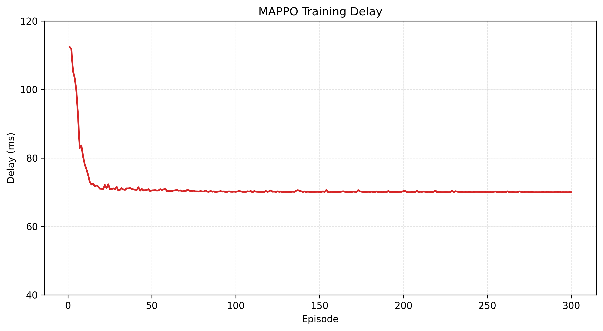
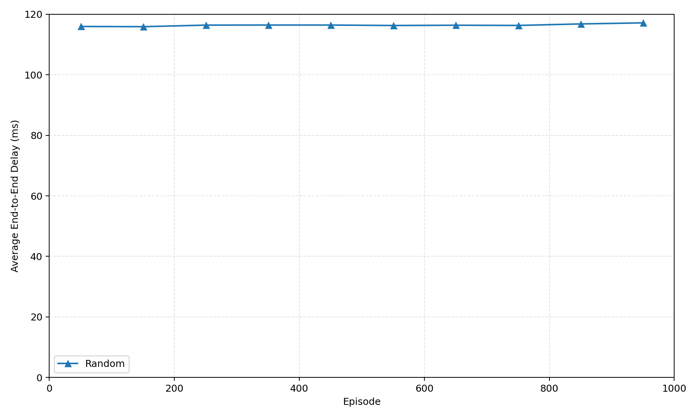

# 面向 RLS–CLS 分层卫星网络的多源遥感任务共享策略 MAPPO

本项目研究动态低轨卫星网络中的多源遥感数据回传问题。当前小论文与代码主线是：在 **RLS（遥感卫星层）—CLS（通信/中继卫星层）—ES（地面站）** 分层网络中，使用**参数共享的 MAPPO**，为多个并发遥感任务联合学习 RLS→CLS 接入、CLS 层多跳路由和出口 CLS 入队动作。

> 当前核心算法是多源任务共享策略 MAPPO，不是 GraphSAGE + CQL。仓库中仍保留早期 CQL/GraphSAGE 代码用于历史实验追溯，但它们不属于当前小论文的核心方法。

## 目录

- [研究场景](#研究场景)
- [共享策略 MAPPO](#共享策略-mappo)
- [项目结构](#项目结构)
- [环境准备](#环境准备)
- [快速开始](#快速开始)
- [对比基线](#对比基线)
- [指标说明](#指标说明)
- [常见问题排查](#常见问题排查)
- [早期 CQL/GraphSAGE 模块](#早期-cqlgraphsag-模块)

## 研究场景

遥感数据采用以下回传链路：


- 目标→RLS：依据波束覆盖、观测质量、离轴角和斜距生成观测任务。
- RLS→CLS：任务智能体在候选接入链路中选择接入 CLS。
- CLS→CLS：任务智能体根据局部状态、候选边特征和队列竞争逐跳选择下一跳。
- CLS→ES：目标 ES 在路由开始前已经固定。达到最小中继跳数后，任务智能体可选择 `egress`，将当前 CLS 选为出口并进入其目的地感知下行队列，等待目标 ES 可见。
- RLS–RLS 链路默认只保留为备份/控制拓扑，不承载观测数据；RLS 不能直接向 ES 下传。

### 默认场景配置

配置文件为 [`configs/remote_sensing_scenario.yaml`](configs/remote_sensing_scenario.yaml)。

| 项目 | 当前配置 |
|---|---|
| 时隙长度 | 30 s |
| 观测目标 | 4 个：3 个固定目标、1 个移动目标 |
| RLS 星座 | 144 星，12×12，580 km，倾角 97.7° |
| CLS 星座 | 30 星，5×6，1150 km，倾角 53° |
| ES 地面站 | 5 个 |
| 最大并发任务数 | 4 |
| RLS→CLS 候选数 | 每个 RLS 最多 4 个 |
| 最小 CLS 中继跳数 | 1 |
| 观测波束 | 可转向；每颗 RLS 最多 2 束，每个目标最多 3 颗候选 RLS |
| 路由代价权重 | 时延 0.4、能耗 0.2、队列 0.3、丢包 0.1 |
| GS 选择权重 | 路径时延 0.35、出口可达性 0.20、可见窗口 0.20、已分配负载 0.25 |
| 下行队列 | 3 个优先级，容量 `[20000, 50000, 100000]`，WPQ 权重 `[1.0, 1.0, 1.0]` |
| GS 前瞻 | 20 时隙；排空阶段 20 时隙 |

默认生成三类异构任务：

| 任务类型 | 数据量 | 优先级 | 截止期 | 生成概率 |
|---|---:|---:|---:|---:|
| `urgent` | 5–10 MB | 0 | 60 s | 0.2 |
| `normal` | 20–50 MB | 1 | 180 s | 0.5 |
| `bulk` | 80–150 MB | 2 | 600 s | 0.3 |

每个业务时隙中，每个被观测目标可生成一个任务。系统优先为不同任务分配不同 RLS，资源不足时允许 RLS 复用；每个任务在路由前根据路径时延、出口可达性、可见窗口和已分配负载确定一个目标 ES。

## 共享策略 MAPPO

### 智能体定义

环境按**任务**组织智能体：每个并发遥感任务对应一条 agent 轨迹，所有任务共享同一组 Actor 参数。CLS 卫星是候选路由节点，而不是每颗卫星各维护一套独立策略；RLS 本身也不是独立智能体。

当前实现采用参数共享 Actor 与集中式 Critic 的 **CTDE 风格结构**。执行端还使用其他任务竞争压力、GS 队列负载和未来链路可见性预测等系统信息；这些信息的可获得性属于当前仿真假设，因此不将其表述为已证明的严格分散执行。

- **共享 Actor**：编码任务局部观测和每条候选边特征，对当前合法动作逐一打分。
- **集中式 Critic**：使用全局状态估计状态价值，训练时刻画多任务竞争、CLS 队列和 ES 服务能力。
- **动作掩码**：屏蔽不存在或非法的接入、ISL 和 egress 动作。
- **PPO 更新**：使用 GAE、裁剪目标、熵正则、价值损失和梯度裁剪。

当前配置下的输入/动作维度如下：

| 项目 | 维度 | 主要内容 |
|---|---:|---|
| 任务局部观测 | 24 | 当前节点、源 RLS、目标 ES、任务大小/类别/剩余期限、累计时延、队列状态、路由阶段和跳数进度 |
| 候选动作特征 | 18 | 动作类型、相对位置、距离、时延、能耗、丢包、队列容量、竞争压力、ES 可达性及服务能力 |
| 动作空间 | 5 | 接入阶段最多 4 个接入动作；中继阶段最多 4 个 ISL 动作及 1 个 egress 动作 |
| 集中式全局状态 | 77 | CLS 队列统计、ES 负载与预测服务能力、业务组成及所有活动任务摘要 |

### 决策过程

1. 任务在源 RLS 处选择一条 RLS→CLS 接入边。
2. 进入 CLS 层后，从未访问的合法 ISL 邻居中选择下一跳。
3. 达到最小中继跳数且预测存在目标 ES 下行机会时，可选择 `egress`。
4. 数据进入出口 CLS 的分类下行队列；调度器先服务最高优先级业务，再在同优先级的可服务队列之间按 WPQ 权重分配服务时间。
5. 任务在截止期内完成下传则成功，否则按超时、TTL、队列竞争或溢出等原因失败。

### 奖励设计

接入和 ISL 决策采用归一化加权代价：

```text
r_step = -(0.4 × delay + 0.2 × energy + 0.3 × queue + 0.1 × loss)
```

egress 决策考虑预测等待时隙与出口队列占用。任务成功时获得成功奖励并扣除归一化端到端时延；任务失败、非法动作、CLS 队列竞争和下行队列溢出均受到惩罚。

## 项目结构

```text
Leo-routing/
├── configs/
│   └── remote_sensing_scenario.yaml       # RLS–CLS–ES 场景与任务参数
├── figures/                               # 选定并提交到仓库的实验图
├── scripts/
│   ├── remote_sensing_random_cli.py       # Random01–04 / Dijkstra 共用 CLI
│   ├── run_remote_sensing_scenario.py     # 确定性场景仿真
│   ├── run_remote_sensing_dijkstra.py     # Dijkstra 基线入口
│   ├── run_remote_sensing_random_baseline.py  # Random01 基线入口
│   ├── 0{1,2,3,4}run_remote_sensing_random_baseline.py  # Random01–04 编号入口
│   ├── check_remote_sensing_beam_model.py # 波束模型输出校验
│   ├── check_remote_sensing_coordinates.py # 坐标框架与地面运动不变量校验
│   └── plot/                              # 训练和基线曲线脚本
├── src/
│   ├── agents/
│   │   ├── MAPPO/                         # ★ 当前核心实现
│   │   │   ├── remote_sensing_agent_env.py    # 并发多源任务环境
│   │   │   ├── vanilla_mappo.py               # 共享 Actor、集中式 Critic 与 PPO
│   │   │   ├── train_mappo_remote_sensing.py  # MAPPO 训练实现
│   │   │   ├── evaluate_mappo_remote_sensing.py
│   │   │   ├── remote_sensing_dijkstra.py     # Dijkstra 路由实现
│   │   │   ├── remote_sensing_route_metrics.py
│   │   │   └── test_*.py                      # 该模块的伴随测试
│   │   ├── train_mappo_remote_sensing.py  # ← 兼容入口，转发到 MAPPO/
│   │   ├── evaluate_mappo_remote_sensing.py # ← 兼容入口
│   │   ├── vanilla_mappo.py               # ← 兼容 shim
│   │   └── ...                            # 早期实验模块，见文末
│   ├── env/
│   │   ├── remote_sensing_scenario.py     # 动态分层星座与链路建模（主线）
│   │   ├── remote_sensing_task_core.py    # 任务生成、GS 选择及下行队列
│   │   ├── remote_sensing_random_baseline.py  # Random01–04 共享仿真核心
│   │   ├── remote_sensing_route_metrics.py
│   │   ├── beam_model.py                  # 观测波束与质量惩罚
│   │   ├── coordinate_utils.py            # 坐标框架转换
│   │   ├── aqm_wpq.py                     # AQM 与 WPQ 队列逻辑
│   │   ├── topology.py                    # Walker 星座拓扑构建（被主线引用）
│   │   ├── link_model.py                  # 链路时延/能耗模型（被主线引用）
│   │   ├── queue_model.py                 # 队列时延模型（被主线引用）
│   │   ├── 0{1,2,3,4}remote_sensing_random_baseline.py  # 变体薄封装
│   │   └── leo_routing_env.py             # 早期离线 RL 环境
│   ├── data/                              # TLE 下载与离线数据集采样
│   ├── eval/                              # Dijkstra 基线与早期评估脚本
│   └── utils/                             # 早期离线数据集工具
├── tests/                                 # 单元测试（24 项）
└── requirements.txt
```

> **关于顶层 `src/agents/*.py`**：这些文件是转发到 `src/agents/MAPPO/` 的兼容入口（部分只有几行 `from agents.MAPPO.xxx import *`），保留是为了让旧命令继续可用。**改动算法请直接编辑 `src/agents/MAPPO/` 下的文件**，否则会被兼容层忽略。

## 环境准备

依赖仅需 `torch`、`torch-geometric`、`matplotlib` 和 `requests`（见 [`requirements.txt`](requirements.txt)）。其中 `torch-geometric` 只被早期 GraphSAGE 模块使用，`requests` 只被 TLE 下载脚本使用；只跑 MAPPO 主线时二者非必需。

```bash
git clone https://github.com/bupt24/Leo-routing.git
cd Leo-routing

python -m venv .venv
source .venv/bin/activate        # Linux/macOS

python -m pip install --upgrade pip
python -m pip install -r requirements.txt
```

Windows PowerShell 使用 `.venv\Scripts\Activate.ps1` 激活虚拟环境。

如不显式传入 `--device`，训练和评估脚本会自动选择 CUDA；CUDA 不可用时回退到 CPU。

## 快速开始

以下命令均从项目根目录执行。

### 1. 环境冒烟测试

用 3 个 episode、每轮 10 个时隙确认环境与训练循环可跑通：

```bash
python src/agents/train_mappo_remote_sensing.py \
  --config configs/remote_sensing_scenario.yaml \
  --episodes 3 \
  --time-slots 10 \
  --eval-episodes 1 \
  --device cpu \
  --output-dir outputs/remote_sensing_mappo/smoke_test
```

### 2. 训练共享策略 MAPPO

```bash
python src/agents/train_mappo_remote_sensing.py \
  --config configs/remote_sensing_scenario.yaml \
  --episodes 300 \
  --time-slots 200 \
  --ttl-cap 8 \
  --num-envs 1 \
  --output-dir outputs/remote_sensing_mappo/paper_run
```

常用参数：

| 参数 | 默认值 | 说明 |
|---|---:|---|
| `--episodes` | 1000 | 训练轮数 |
| `--time-slots` | 10 | 每轮生成任务的时隙数 |
| `--eval-time-slots` | 0 | 评估阶段时隙数；0 表示与 `--time-slots` 相同 |
| `--base-seed` | 42 | 随机种子基准 |
| `--ttl-cap` | 10 | CLS ISL 跳数 TTL；达到该值时判定超限失败 |
| `--drain-slots` | -1 | 排空时隙数；-1 表示沿用配置文件 |
| `--num-envs` | 1 | 每轮创建的环境实例数；当前实现批量进行策略推理，但依次执行各环境的 `step()`，不启用多进程 |
| `--env-cache` | `memory` | 是否缓存动态拓扑快照（`off` / `memory`） |
| `--hidden-dim` | 128 | Actor/Critic 隐层维度 |
| `--lr` | `1e-4` | 学习率 |
| `--gamma` | 0.99 | 折扣因子 |
| `--gae-lambda` | 0.95 | GAE 参数 |
| `--clip-ratio` | 0.2 | PPO 裁剪范围 |
| `--value-coef` | 0.5 | 价值损失系数 |
| `--entropy-coef` | 0.05 | 熵正则系数 |
| `--max-grad-norm` | 0.5 | 梯度裁剪范数 |
| `--update-epochs` | 2 | 每批数据的 PPO 更新轮数 |
| `--minibatch-size` | 2048 | 小批量大小 |
| `--eval-episodes` | 3 | 每次确定性评估的 episode 数 |
| `--eval-interval` | 50 | 确定性评估间隔 |
| `--checkpoint-interval` | 10 | checkpoint 保存间隔 |
| `--output-root` | `outputs/remote_sensing_mappo` | 输出根目录 |
| `--output-dir` | 空 | 指定完整输出目录；留空则在 `--output-root` 下按时间戳生成 |
| `--device` | 空 | 空表示自动选择 CUDA/CPU |
| `--no-plot` | 关闭 | 传该标志可跳过训练曲线绘制 |

当前版本不支持 `--rollout-mode` 和 `--rollout-workers`；含 `mode=mp workers=2` 的历史日志来自旧版脚本。

训练输出位于 `outputs/remote_sensing_mappo/<run>/`：

```text
latest.pt                       # 每个 checkpoint 间隔覆盖
best.pt                         # 仅当评估刷新最佳 eval_reward 时生成
mappo_training_metrics.csv
mappo_training_curves.png       # 除非传 --no-plot
training_summary.json
```

### 3. 评估 MAPPO

```bash
python src/agents/evaluate_mappo_remote_sensing.py \
  --checkpoint outputs/remote_sensing_mappo/paper_run/best.pt \
  --config configs/remote_sensing_scenario.yaml \
  --episodes 100 \
  --time-slots 600 \
  --ttl-cap 8
```

评估脚本参数与训练基本对齐：`--checkpoint`（必填）、`--config`、`--episodes`、`--time-slots`、`--base-seed`、`--ttl-cap`、`--drain-slots`、`--output-dir`、`--device`。

评估输出位于 `outputs/remote_sensing_mappo_eval/<run>/`：

```text
mappo_routes.csv
mappo_episode_metrics.csv
mappo_downlink_queues.csv
mappo_evaluation_summary.json
```

### 4. 重新绘制 MAPPO 曲线

```bash
python scripts/plot/run_mappo_training_curves.py \
  --metrics-csv outputs/remote_sensing_mappo/paper_run/mappo_training_metrics.csv \
  --output-dir outputs/remote_sensing_mappo/paper_run \
  --prefix paper_mappo \
  --x-axis episode \
  --dpi 300
```

`scripts/plot/` 下另有基线曲线脚本：`run_random_episode_delay_curve.py`、`run_random_avg100_delay_curve.py`、`run_random03_episode_delay_curve.py`、`run_random04_episode_delay_curve.py`，以及按时间隙汇总端到端时延与能耗的 `analyze_end_to_end_slot_metrics.py`。

## 对比基线

所有基线共用 [`scripts/remote_sensing_random_cli.py`](scripts/remote_sensing_random_cli.py)，共用参数为 `--config`、`--time-slots`、`--random-seed`、`--ttl-cap`、`--ttl-margin`、`--drain-slots`、`--output-dir`；`--max-attempts` 仅对 Random03/04 生效（默认 8）。

| 变体 | 入口 | 路由行为 |
|---|---|---|
| Dijkstra | `scripts/run_remote_sensing_dijkstra.py` | 按链路代价求最短路径 |
| Random01 | `scripts/run_remote_sensing_random_baseline.py`<br>`scripts/01run_remote_sensing_random_baseline.py` | 随机路由，带前瞻（不主动走进死胡同） |
| Random02 | `scripts/02run_remote_sensing_random_baseline.py` | 随机路由，无前瞻，可能进入死胡同后失败 |
| Random03 | `scripts/03run_remote_sensing_random_baseline.py` | 在随机接入基础上允许重试，累计失败尝试的时延与能耗 |
| Random04 | `scripts/04run_remote_sensing_random_baseline.py` | 重试变体，接入决策按协作打分选择（考虑队列与剩余容量） |

> Random01 与 Random02 的差别正是「是否前瞻」，做消融或基线对比时请明确说明选中哪一个，二者成功率差异较大。

示例：

```bash
python scripts/run_remote_sensing_dijkstra.py \
  --config configs/remote_sensing_scenario.yaml \
  --time-slots 600 --ttl-cap 8 --random-seed 42

python scripts/run_remote_sensing_random_baseline.py \
  --config configs/remote_sensing_scenario.yaml \
  --time-slots 600 --ttl-cap 8 --random-seed 42

python scripts/03run_remote_sensing_random_baseline.py --time-slots 600 --max-attempts 8
python scripts/04run_remote_sensing_random_baseline.py --time-slots 600 --max-attempts 8
```

为了保证论文比较公平，应让 MAPPO、Dijkstra 和随机基线使用相同的 YAML、时隙数、TTL、随机种子集合与指标口径。
MAPPO 示例按多个 episode 评估，而基线 CLI 每次运行一次指定时长的仿真；正式比较时应对基线逐个运行同一组种子，再按相同统计单位聚合。

另有 `scripts/check_remote_sensing_coordinates.py` 与 `scripts/check_remote_sensing_beam_model.py` 两个校验脚本，用于确认坐标框架和波束输出符合预期，改动环境建模后建议先跑一遍：

```bash
python scripts/check_remote_sensing_coordinates.py --config configs/remote_sensing_scenario.yaml

# 波束校验作用在已生成的仿真输出上，--output-dir 为必填
python scripts/check_remote_sensing_beam_model.py \
  --output-dir outputs/remote_sensing_scenario/<run>
```

## 指标说明

| 指标 | 含义 |
|---|---|
| `success_rate` | 成功送达任务数 / 总任务数 |
| `deadline_meeting_rate` | 截止期内完成任务的比例；当前实现中与 `success_rate` 相同 |
| `avg_delay_success_ms` | 成功任务平均端到端时延 |
| `avg_delay_actual_all_ms` | 全部任务的实际平均累计时延 |
| `avg_cls_delay_success_ms` | 成功任务的 RLS→CLS 接入及 CLS 中继累计时延，不含下行等待/服务 |
| `avg_energy_success_j` | 成功任务平均能耗 |
| `avg_loss_success` | 成功任务平均累计丢包风险 |
| `avg_reward_all` | 所有任务的平均累计奖励 |
| `throughput_mbps` | 成功交付数据量除以任务生成阶段时长；分母不含 drain slots |

训练 CSV 还记录 `policy_loss`、`value_loss`、`entropy` 和 `total_loss`；按评估间隔记录 `eval_reward`、`eval_delay` 和 `eval_success_rate`。

## 已提交的实验图

### 历史 300 轮 MAPPO 训练时延



### Random 基线时延（100-episode 窗口平均）



上述图片用于展示仓库中已有实验趋势。当前环境使用 `multi_source_concurrent_v2` schema；论文最终结果应由当前代码在统一场景、种子和指标口径下重新生成，不应仅凭两张历史曲线直接得出算法优劣结论。

## 测试

```bash
PYTHONDONTWRITEBYTECODE=1 python -m unittest discover \
  -s tests \
  -p 'test_*.py' \
  -v
```

共 24 项测试，覆盖多源任务生成、RLS 接入、CLS 路由、下行队列服务、随机基线语义（含 Random01/02 前瞻差异）、动作掩码、GAE 和 PPO 参数更新等关键逻辑。

> `src/agents/MAPPO/` 下还有 `test_remote_sensing_agent_env.py` 和 `test_vanilla_mappo.py` 两个伴随测试。上面的 `discover -s tests` 只扫描 `tests/` 目录，不会执行它们；如需一并运行，请在 `src/agents/MAPPO/` 目录下单独执行。

## 常见问题排查

| 现象 | 排查方向 |
|---|---|
| 训练一开始就报维度不匹配 | 改动环境后 Actor/Critic 输入维度需同步；确认观测 24、动作特征 18、全局状态 77 |
| `best.pt` 没有生成 | 确认 `--eval-episodes` 大于 0、训练已运行至评估轮次；即使 `--eval-interval` 大于 `--episodes`，最后一轮仍会评估 |
| 改了代码但训练行为不变 | 可能改到了 `src/agents/` 顶层的兼容 shim；算法实现以 `src/agents/MAPPO/` 为准 |
| 基线成功率与预期差距很大 | 确认用的是 Random01（前瞻）还是 Random02（不前瞻），并核对 `--max-attempts` |
| 与论文数字对不上 | 核对 YAML、时隙数、TTL、种子集合与指标口径是否完全一致；`throughput_mbps` 分母不含 drain slots |
| 找不到输出文件 | 未传 `--output-dir` 时输出按时间戳落在 `outputs/<实验名>/<run>/` 下 |

## 早期 CQL/GraphSAGE 模块

以下文件属于早期离线强化学习实验，继续保留以便追溯和对照：

- `src/agents/model.py`（GraphSAGE + SAGEConv）
- `src/agents/cql_trainer.py`
- `src/agents/train_offline.py`
- `src/agents/geometric_model.py`、`src/agents/train_geometric.py`、`src/agents/train_supervised.py`
- `src/data/`（TLE 下载、离线数据集采样与预计算）
- `src/eval/dijkstra_baseline.py`、`src/eval/evaluate.py`（早期 DRL vs Dijkstra 对比）
- `src/env/leo_routing_env.py`（早期离线 RL 环境，仅被 `src/agents/evaluate.py` 与 `src/data/` 使用）

它们不是当前 RLS–CLS 多源遥感任务论文的核心算法。论文方法、实验设计和结果分析应以 `src/agents/MAPPO/` 下的共享策略 MAPPO 及对应多源环境为准。

> 注意区分：`src/env/topology.py`、`link_model.py`、`queue_model.py` 虽然名字通用，但被当前主线 `remote_sensing_scenario.py` 引用，属于**在用**模块，不要当作废弃代码删除。

## 数据与训练产物

仓库通过 `.gitignore` 排除本地数据集、模型权重、虚拟环境和大规模训练输出，包括 `data/`、`outputs/`、`checkpoints/`、`venv/`、`*.pt`、`*.pth`、`*.pkl` 与 `docs/` 下的文档等。需要共享实验结果时，建议只提交经过筛选的图表或使用独立的发布/对象存储。

## 参考文献

- Yu et al., [The Surprising Effectiveness of PPO in Cooperative Multi-Agent Games](https://arxiv.org/abs/2103.01955)
- Schulman et al., [Proximal Policy Optimization Algorithms](https://arxiv.org/abs/1707.06347)
